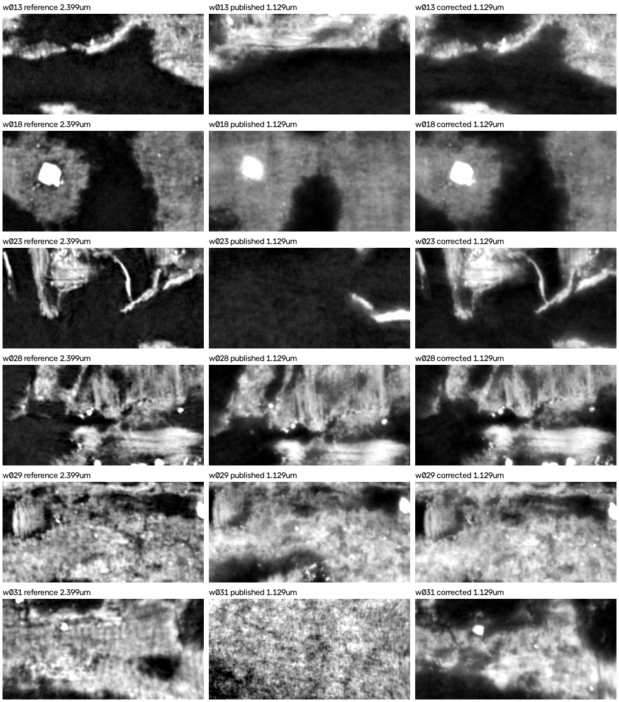

# V-014: the PHerc1667 1.129 µm → 2.399 µm transform puts meshes off the papyrus

Follow-up to [villa #1843](https://github.com/ScrollPrize/villa/issues/1843). Protocol: [PROTOCOL.md](PROTOCOL.md).

## Summary

- **The matrix does not match its own landmarks.** The published `transform.json` for the 1.129 µm
  volume `20260323082859` misses its landmarks by 51.4 voxels RMS at 2.399 µm (123 µm). A least-squares
  affine fit to the same 6 landmarks misses them by 0.93 voxels, with a leave-one-out error of 2.7
  voxels. That refit's scale, 0.4714 / 0.4710 / 0.4708, matches the physical ratio
  1.129 / 2.399 = 0.4706.
- **The published 1.129 µm meshes inherit the error.** They are the 2.399 µm meshes pushed through
  this matrix. On w029 they lie a median 7.9 px from the published 2.399 µm mesh after mapping back
  with the published matrix.
- **The refit puts the meshes back on the papyrus.**
  - On all 6 segments with ink labels, the CT along the refit mesh matches the 2.399 µm reference
    better than the CT along the published mesh: NCC 0.59–0.80 on 5 segments versus −0.13–0.52.
  - On the sixth, w031, the refit mesh reaches NCC 0.72 after a 13-layer (about 29 µm) depth shift.
  - The published mesh is off by more than the ±12 px / ±20 layer search box on most segments.
- **Across the bucket, only this file has the problem.** Of the 22 published transform files,
  only this one has a matrix that disagrees with its landmarks. The other large residuals are
  landmark problems, as #1835 reports.

Each row is one segment. The panels show the centre layer of the 2.399 µm reference, then the
1.129 µm scan along the published mesh, then the 1.129 µm scan along the corrected mesh.

## CT placement check (preregistered, PASS)

Run `20261004T221746-af44d82947`. For each segment's densest labelled window, the central 8 × 16
grid cells (160 × 320 px at 2.399 µm) were rendered with 61 layers in three ways:
- **R:** the 2.399 µm mesh on the 2.399 µm scan.
- **P:** the 1.129 µm scan along `M_pub⁻¹ · p`.
- **C:** the 1.129 µm scan along `M_lsq⁻¹ · p`.

The statistic is the NCC of the central 21 layers against R. The pass rule was C > P on all 6
segments and C ≥ 0.4 on at least 5.

| Segment | NCC P | NCC C | Best P (layers, y, x) | Best C (layers, y, x) | Displacement P↔C, median µm |
|---|---|---|---|---|---|
| w013 | 0.116 | **0.650** | 0.237 (11, −12, 12) | 0.658 (−1, −2, −2) | 124 |
| w018 | 0.515 | **0.801** | 0.804 (20, −10, −8) | 0.819 (3, −2, −2) | 38 |
| w023 | −0.125 | **0.780** | 0.086 (20, −12, −12) | 0.810 (−5, −2, 2) | 166 |
| w028 | 0.329 | **0.769** | 0.610 (4, 12, −4) | 0.793 (−2, −2, −2) | 56 |
| w029 | 0.186 | **0.588** | 0.565 (−6, −12, −8) | 0.621 (0, 2, −2) | 44 |
| w031 | 0.021 | **0.185** | 0.066 (−9, −12, −8) | 0.716 (−13, 4, 0) | 411 |

## Ink model (preregistered primary test, in progress)

The canonical 2.4 µm model (`scrollprize/ink_canonical_2um`) was run on each arm.
- On w013 it gives AUC 0.990 on R, 0.608 on P and 0.514 on C.
- Since C sits on the same papyrus as R, the low score on C says this model, trained on 2.4 µm
  78 keV data, does not read the 59 keV 1.129 µm scan. It does not say the mesh is wrong.
- Fixing the transform is therefore necessary but not sufficient for 1.129 µm ink work. Ink
  results on the 1.129 µm scan also need a model trained or adapted for that scan.
- Full ink results for all six segments will be added here when the run ends.

## What should change

1. Replace the matrix in
   `PHerc1667/volumes/20260323082859-1.129um-0.2m-59keV-masked.zarr/transform.json` with the
   least-squares fit to its own landmarks:
   `python check_transform.py <url> --refit transform_refit.json` from the villa branch below.
2. Rebuild the 1.129 µm meshes (19 of 20 PHerc1667 segments) and anything rendered from them. A
   published 1.129 µm vertex `q` maps to the corrected vertex `M_lsq⁻¹ · M_pub · q`.
3. Check w031 separately. It keeps a residual depth offset of about 13 layers after the fix.

A check that catches this at write time is on
[neg-0/villa `volume-registration-landmark-check`](https://github.com/neg-0/villa/tree/volume-registration-landmark-check).
It flags exactly this one file among the 22 published transforms.

## Files

- `results/ct-placement.json`: per-segment NCC, shifts and windows.
- `results/ct-placement-centre-layer.png`: the figure above.
- `results/transform-audit.{csv,json}`: all 22 transform files in the bucket. Residuals are in
  fixed-volume voxels.
- `code/`: `v014_transform_ink.py` (window selection, the three arms, ink AUC),
  `v014_ct_placement.py` (the NCC check) and `v015_transform_audit.py` (the bucket audit).
