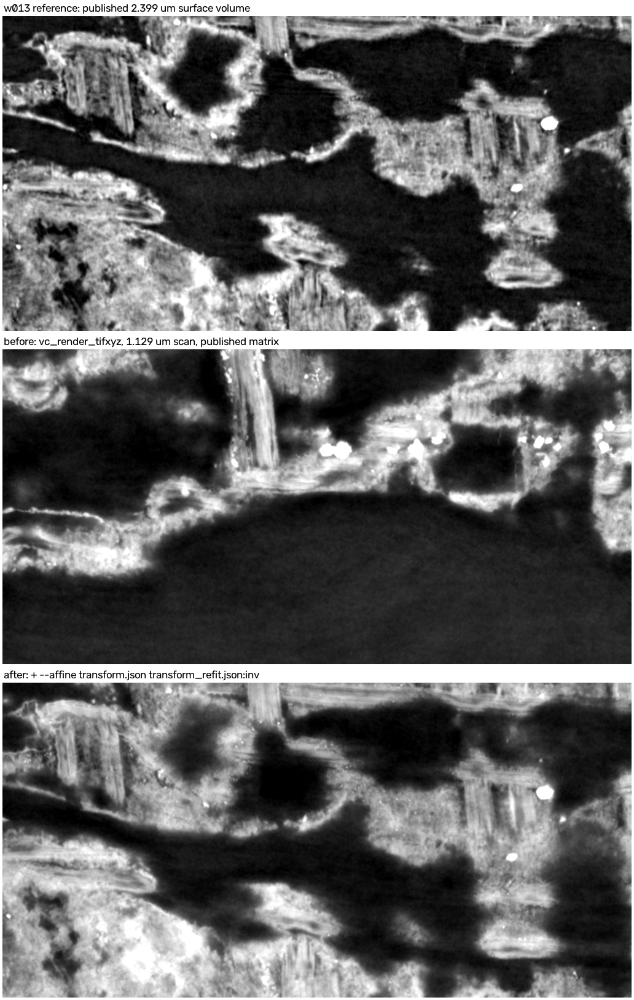
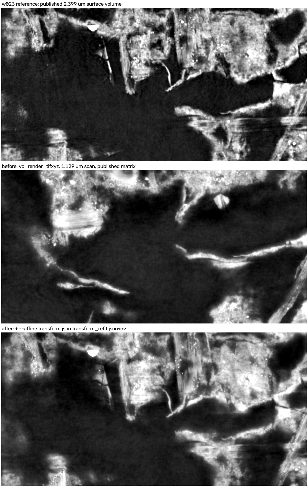

# Verification with villa's own tools

Run `20261004T230742-031347b1e2`. Script: [code/v014_vc_verify.py](code/v014_vc_verify.py).

**What was used.**
- `vc_transform_geom` and `vc_render_tifxyz` from ScrollPrize/villa
  [5a4388f](https://github.com/ScrollPrize/villa/tree/5a4388f08cc547e6a1a037f949173e731a3e7aa2/volume-cartographer),
  built Release with no source changes.
- `check_transform.py --refit` from
  [neg-0/villa `volume-registration-landmark-check`](https://github.com/neg-0/villa/tree/volume-registration-landmark-check).

**Steps for each of the 6 PHerc1667 segments with ink labels.**
1. `vc_transform_geom -i <2.399 µm mesh> -a transform.json --invert` reproduces the **published**
   1.129 µm mesh. The median difference is ≤ 0.014 voxels; on three segments the regridded mesh is one
   row or column larger.
2. `vc_render_tifxyz -g 1 --scale 1 -s <published 1.129 µm mesh>` reproduces the **published** 1.129 µm
   L1 surface volume with NCC ≥ 0.996 on every segment. This is the "before".
3. The same command with `--affine transform.json transform_refit.json:inv` renders the "after". It maps
   the published mesh back to the 2.399 µm frame and forward again with the refit matrix.
4. Before and after are compared with the published 2.399 µm surface volume of the same patch, a
   512 × 1024 px crop at L1. The search covers ±40 px and the reference's central 21 layers.

| Segment | Before: best NCC | After: best NCC | Before: zero shift | After: zero shift |
|---|---|---|---|---|
| w013 | 0.06 | **0.91** | 0.00 | 0.77 |
| w018 | 0.65 | **0.84** | 0.42 | 0.76 |
| w023 | 0.22 | **0.92** | −0.06 | 0.82 |
| w028 | 0.75 | **0.91** | 0.41 | 0.74 |
| w029 | 0.59 | **0.82** | 0.22 | 0.62 |
| w031 | 0.21 | **0.88** | 0.07 | 0.46 |

**What the table shows.**
- On w013, w023 and w031 the before render's best match lies at the edge of the ±40 px search, so its
  true offset is larger than the search.
- The after render's best match is within 12 px in-plane on every segment.
- The after render's best reference layer is 10–15 of 21. That is a small, consistent depth offset
  between the two scans, not a placement error.

Each image shows three panels: the published 2.399 µm surface volume, then the 1.129 µm render with the
published matrix (before), then the same render with the refit (after). All six are in
[results/villa-tools/](results/villa-tools/).
