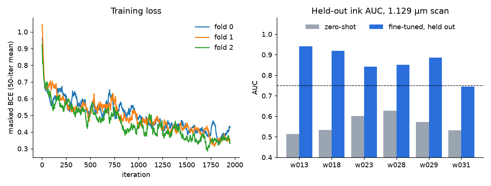

# V-016 result: the 2.4 µm ink model, fine-tuned along the refit meshes, reads PHerc1667's 1.129 µm scan

**Verdict: PASS** (under Amendment 1; see below). Fine-tuning `scrollprize/ink_canonical_2um` on 1.129 µm renders
along the landmark-refit meshes from [V-014](../v014-pherc1667-transform/) lets it read ink on segments it never
trained on.

| Fold | Held-out segment | Zero-shot AUC | Fine-tuned AUC | Label-shift offset (ds8 px) |
|---|---|---|---|---|
| 0 | w013 | 0.514 | **0.941** | (4, 4) |
| 0 | w018 | 0.535 | **0.919** | (2, 4) |
| 1 | w023 | 0.602 | **0.843** | (4, 2) |
| 1 | w028 | 0.627 | **0.852** | (−2, −2) |
| 2 | w029 | 0.573 | **0.886** | (2, −2) |
| 2 | w031 | 0.532 | **0.744** | (0, 4) |
| | **mean** | 0.564 | **0.864** | |

- **Pass rule:** mean held-out AUC at least 0.75, and fine-tuned above zero-shot on at least 5 of 6 segments. The
  result is 0.864, above zero-shot on 6 of 6.
- **Each segment is scored by a model that never saw it.** Each fold trains on the other four segments' densest
  labelled patches and stays at least 10 grid cells clear of their own test windows. It is then scored on the V-014
  test windows of the held-out pair.
- **The fine-tuned maps register to the labels without the shift search.** `eval_map` searches label shifts of up to
  ±48 ds8 px. The fine-tuned maps land within ±4 px of zero on every segment, while the zero-shot maps sat at the
  ±48 edge on most segments, as in V-014.
- **The baseline reproduces V-014 exactly.** Zero-shot values equal V-014's arm C numbers to four decimals; w028
  gives 0.6268 against 0.6268.
- **w031 is the weakest (0.744).** It is the segment where V-014's placement check found the best match 13 layers
  off the mesh, so a residual depth error there is the likely cause, though that is not tested.

## Amendment 1

The first fold-0 run diverged (NaN from iteration 361). The cause was a training forward pass that skipped the
model's input normalisation layer, which inference applies. The fix was made before any informative held-out score
existed:
- apply that layer;
- drop non-finite micro-batches;
- refuse to save non-finite weights.

Nothing else changed; the full record is in [PROTOCOL.md](PROTOCOL.md). The failed run's eval is kept as
`results/v016-eval-C-fold0-run1-nan-before-amendment1.json`. In the amended runs, 4–5 of 2000 steps per fold were
skipped as non-finite.

## What this does and does not show

- **It shows** an ink model reading a scan at a different resolution and energy (1.129 µm, 59 keV) from the one it
  was trained on (2.4 µm, 78 keV). It needs only labels drawn on the other scan and a correct transform between the
  two.
- **The transform matters.** V-014 showed that the published PHerc1667 matrix puts 1.129 µm meshes 38–411 µm off
  the papyrus. The labels supervise the right CT only along the refit mesh.
- **It does not yet show** that the refit mesh trains a better model than the published one. The same run along
  the published meshes was attempted and is not a valid comparison: 2 of its 3 folds diverged (backbone activations
  grew until the fp16 decoder overflowed, so their ink maps are NaN). The one fold that trained normally splits one
  each way against the refit mesh (w023: published 0.722, refit 0.843; w028: published 0.892, refit 0.852). A rerun
  of both arms with one numerically stable recipe (bfloat16) is registered and queued.
- **It does not show** whether the fine-tuned model still reads the 2.399 µm scan.
- **Scope:** six segments of one scroll, one seed, one training recipe fixed in advance.

## Reproduce

See [`code/README.md`](code/README.md). The run IDs below are from the local research runner:

| Step | Run ID(s) |
|---|---|
| prep | `20261005T035534-83b96db6b4` (timed out), `20261005T054549-760abe9737` |
| w028 baseline | `20261005T060357-e7394d62ac` |
| fold 0, first run (NaN, kept) | train `20261005T060447-305b165b7f`, eval `20261005T062717-18a8f589d5` |
| fold 0 | train `20261005T063049-c41fd59cbd`, eval `20261005T065604-5143fdf8a1` |
| fold 1 | train `20261005T065655-df1d9002c4`, eval `20261005T072406-24d94ea500` |
| fold 2 | train `20261005T072523-4c3c5db63a`, eval `20261005T075225-1e3cb6f1c4` |
| verdict | `20261005T075420-0ecf0300b8` |

Each fold took about 28 minutes to train on one RTX 3080 (10 GB).
